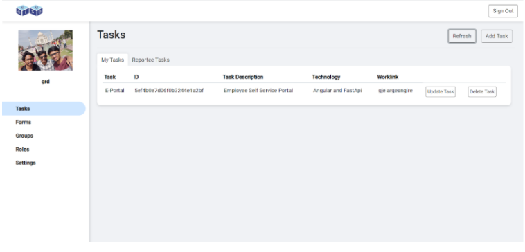

# E-portal
An enterprise information portal (e-portal) is a single gateway through which to gain access to all the information, data, systems, and processes used by stakeholders of an organization.

# Project Methodology:
We used Angular for UI, Mongodb for storing all the data of employees and Flask and FastApi for back end services.

# Frontend:
The project e-portal basically contains all the information about the employee of a company. In the login page we will have company logo , if there are any birthdays of employees we will display their picture and wish them a “Happy Birthday” on the left and on right we will display the holidays in this month excluding (Saturday and Sunday).In the center we will ask them about their login id and password they will get an option to check in and check out we will capture a picture of them while they check in or check out.

If the user enters their correct id and password, we will take them to the next page We used JWT tokens to provide user security for their logins. In the next page the user will get options to see their tasks that are pending and information about the tasks they performed previously, and they have an option to apply for leave. When they apply for a leave the request will be sent to his superior and he will be approving it. We can change the password. We can add Reportees and can assign tasks to them. The role of the user is set at administrator level.

# Backend:
In the backend to develop services we have MongoDB to store and retrieve data used and FastApi to perform operations on the data. We have seven collections in database and we have developed few services to perform operations on each collection that are required for our web applications. There is a swagger document generated in FastApi which we can test our services.
